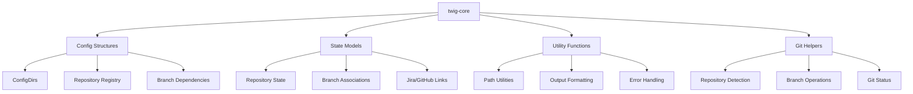
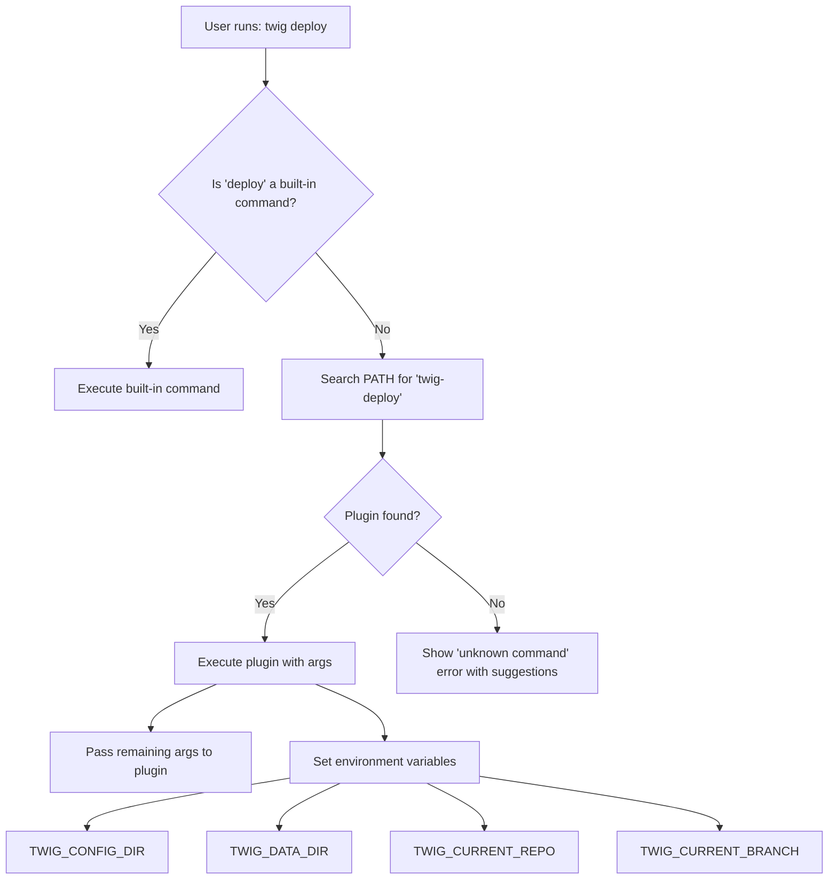
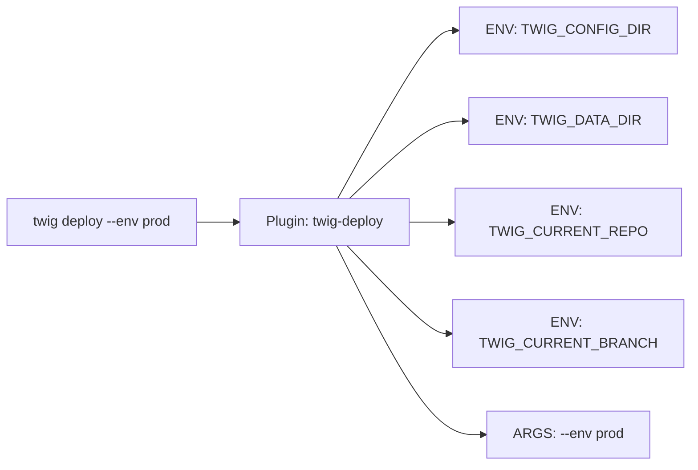

# Twig Plugin System Architecture

## Overview

This document outlines the design and implementation plan for a kubectl/Docker-inspired plugin system for twig. The plugin system allows extending twig with external commands while maintaining the core principle that built-in commands always take precedence over plugins.

## Requirements

1. **Built-in Command Precedence**: Built-in top-level commands must always take precedence over plugins
2. **Language Agnostic**: Plugins must be implementable in any language using a `$PATH`-based lookup system
3. **Rust Integration**: Plugins implemented in Rust should be able to reuse all of our config structures through a core library
4. **Simple Distribution**: No fancy distribution or installation - users find and install plugin binaries themselves

## Architecture Components

### 1. Core Library (`twig-core`)

A new crate that exposes twig's configuration structures and utilities for plugin developers:



**Key Principles:**
- **Read-only access** to twig's configuration and state
- Plugins manage their own state separately
- Consistent interfaces for common operations

### 2. Plugin Discovery System

The CLI command handling will be modified to include plugin discovery:



**Plugin Naming Convention:**
- All plugins must be named `twig-<plugin-name>`
- Examples: `twig-deploy`, `twig-backup`, `twig-lint`

### 3. Plugin Interface Contract

Plugins receive information through:

#### Environment Variables
- `TWIG_CONFIG_DIR`: Path to twig's configuration directory
- `TWIG_DATA_DIR`: Path to twig's data directory
- `TWIG_CURRENT_REPO`: Current repository path (if in a repo)
- `TWIG_CURRENT_BRANCH`: Current branch name (if in a repo)
- `TWIG_VERSION`: Version of twig core that invoked the plugin

#### Command Line Arguments
- All arguments after the plugin name are passed through unchanged
- Example: `twig deploy --env prod --force` → plugin receives `["--env", "prod", "--force"]`

#### Exit Codes
- `0`: Success
- `1`: General error
- `2`: Misuse of command (invalid arguments)
- `130`: Interrupted by user (Ctrl+C)



## Implementation Plan

### Phase 1: Core Library Extraction

1. **Create `twig-core` crate**
   - Extract configuration structures from `twig-cli/src/config/`
   - Extract state management from `twig-cli/src/state/` and `twig-cli/src/repo_state/`
   - Create read-only interfaces for plugin access
   - Add utility functions for common operations
   - Include output formatting utilities for consistent UX

2. **Refactor existing crates**
   - Update `twig-cli` to use `twig-core`
   - Update `twig-gh` and `twig-jira` to use `twig-core`
   - Ensure backward compatibility
   - Update workspace dependencies

### Phase 2: Plugin Discovery Implementation

1. **Modify CLI parsing**
   - Update `handle_cli()` function to catch unknown commands
   - Implement plugin discovery logic using `$PATH` lookup
   - Add environment variable setup for plugins
   - Handle plugin execution and exit code propagation

2. **Plugin execution system**
   - Create plugin runner that handles process spawning
   - Implement argument passing and environment setup
   - Handle plugin exit codes and output streaming
   - Add error handling for missing or failing plugins

### Phase 3: Plugin Development Support

1. **Create plugin templates and examples**
   - Rust plugin template using `twig-core`
   - Python plugin example
   - Shell script plugin example
   - Documentation for other languages

2. **Documentation and best practices**
   - Plugin development guide
   - CLI interface consistency guidelines
   - Testing strategies for plugins
   - Distribution recommendations

3. **Testing and validation**
   - Integration tests for plugin system
   - Example plugins for testing
   - Performance benchmarks

## Plugin Development Best Practices

### CLI Interface Consistency

To maintain a consistent user experience across all twig plugins, follow these guidelines:

#### Command Structure
```bash
twig-<plugin-name> [GLOBAL_OPTIONS] <SUBCOMMAND> [SUBCOMMAND_OPTIONS] [ARGS]
```

#### Global Options (Recommended)
- `--help, -h`: Show help information
- `--version, -V`: Show plugin version
- `--verbose, -v`: Increase verbosity (can be repeated)
- `--quiet, -q`: Suppress non-essential output
- `--color <WHEN>`: Control colored output (auto, always, never)
- `--config <PATH>`: Override config directory (use `TWIG_CONFIG_DIR` as default)

#### Help Text Format
```
<plugin-name> <version>
<brief-description>

USAGE:
    twig <plugin-name> [OPTIONS] <SUBCOMMAND>

OPTIONS:
    -h, --help       Print help information
    -V, --version    Print version information
    -v, --verbose    Increase verbosity
    -q, --quiet      Suppress non-essential output

SUBCOMMANDS:
    <subcommand>    <description>
    help            Print this message or the help of the given subcommand(s)
```

#### Error Handling
- Use consistent error message format: `Error: <description>`
- Provide actionable error messages when possible
- Use appropriate exit codes (see Interface Contract above)
- Include suggestions for common mistakes

#### Output Formatting
- Use colors consistently with twig's color scheme
- Respect the `--color` option and `NO_COLOR` environment variable
- Use emojis sparingly and consistently with twig's style
- Format tables and lists consistently

### Language-Specific Guidelines

#### Rust Plugins
```rust
// Use twig-core for configuration access
use twig_core::{get_config_dirs, current_repository, current_branch};
use clap::{Parser, Subcommand};

#[derive(Parser)]
#[command(name = "twig-deploy")]
#[command(about = "Deploy applications using twig context")]
struct Cli {
    #[command(subcommand)]
    command: Commands,

    /// Increase verbosity
    #[arg(short, long, action = clap::ArgAction::Count)]
    verbose: u8,
}

#[derive(Subcommand)]
enum Commands {
    /// Deploy to staging environment
    Staging { /* ... */ },
    /// Deploy to production environment
    Production { /* ... */ },
}
```

#### Python Plugins
```python
#!/usr/bin/env python3
import os
import sys
import argparse
from pathlib import Path

def get_twig_config():
    """Get twig configuration from environment variables."""
    return {
        'config_dir': Path(os.environ.get('TWIG_CONFIG_DIR', '')),
        'data_dir': Path(os.environ.get('TWIG_DATA_DIR', '')),
        'current_repo': os.environ.get('TWIG_CURRENT_REPO'),
        'current_branch': os.environ.get('TWIG_CURRENT_BRANCH'),
    }

def main():
    parser = argparse.ArgumentParser(
        prog='twig-backup',
        description='Backup repositories using twig context'
    )
    parser.add_argument('-v', '--verbose', action='count', default=0)
    parser.add_argument('--color', choices=['auto', 'always', 'never'], default='auto')
    # ... add subcommands

    args = parser.parse_args()
    config = get_twig_config()

    # Plugin logic here
```

#### Shell Script Plugins
```bash
#!/bin/bash
set -euo pipefail

# Plugin metadata
PLUGIN_NAME="twig-sync"
PLUGIN_VERSION="1.0.0"

# Parse common options
VERBOSE=0
COLOR="auto"

show_help() {
    cat << EOF
$PLUGIN_NAME $PLUGIN_VERSION
Sync repositories using twig context

USAGE:
    twig sync [OPTIONS] <COMMAND>

OPTIONS:
    -h, --help       Print help information
    -V, --version    Print version information
    -v, --verbose    Increase verbosity
    --color <WHEN>   Control colored output [auto, always, never]

COMMANDS:
    all     Sync all tracked repositories
    current Sync current repository only
EOF
}

# Access twig configuration
TWIG_CONFIG_DIR="${TWIG_CONFIG_DIR:-}"
TWIG_DATA_DIR="${TWIG_DATA_DIR:-}"
TWIG_CURRENT_REPO="${TWIG_CURRENT_REPO:-}"
TWIG_CURRENT_BRANCH="${TWIG_CURRENT_BRANCH:-}"
```

### Plugin State Management

Plugins should manage their own state separately from twig's core state:

#### Recommended State Locations
- **Configuration**: `$TWIG_CONFIG_DIR/plugins/<plugin-name>/`
- **Data/Cache**: `$TWIG_DATA_DIR/plugins/<plugin-name>/`
- **Logs**: `$TWIG_DATA_DIR/plugins/<plugin-name>/logs/`

#### State File Formats
- Use JSON for simple configuration
- Use TOML for complex configuration files
- Use SQLite for structured data that needs querying
- Follow XDG Base Directory specification when possible

## Detailed Implementation

### Core Library Structure

```rust
// twig-core/src/lib.rs
pub mod config;
pub mod state;
pub mod git;
pub mod utils;
pub mod output;

// Re-export main types for plugin developers
pub use config::{ConfigDirs, get_config_dirs};
pub use state::{RepoState, BranchAssociations};
pub use git::{current_repository, current_branch, detect_repository};
pub use output::{ColorMode, format_repo_path, print_success, print_error};

// Plugin-specific utilities
pub mod plugin {
    pub use super::config::get_config_dirs;
    pub use super::git::{current_repository, current_branch};

    /// Get the current working directory as a repository path
    pub fn current_working_repo() -> Result<Option<PathBuf>> { /* ... */ }

    /// Check if we're currently in a git repository
    pub fn in_git_repository() -> bool { /* ... */ }

    /// Get plugin-specific config directory
    pub fn plugin_config_dir(plugin_name: &str) -> Result<PathBuf> { /* ... */ }

    /// Get plugin-specific data directory
    pub fn plugin_data_dir(plugin_name: &str) -> Result<PathBuf> { /* ... */ }
}
```

### Plugin Discovery Logic

```rust
// twig-cli/src/plugin/mod.rs
use std::process::{Command, Stdio};
use std::env;
use anyhow::{Result, Context};

pub fn execute_plugin(plugin_name: &str, args: Vec<String>) -> Result<()> {
    let plugin_binary = format!("twig-{}", plugin_name);

    // Check if plugin exists in PATH
    if !plugin_exists(&plugin_binary)? {
        return Err(anyhow::anyhow!(
            "Unknown command '{}'. No plugin 'twig-{}' found in PATH.",
            plugin_name, plugin_name
        ));
    }

    // Set up environment variables
    let config_dirs = twig_core::get_config_dirs()?;
    let current_repo = twig_core::current_repository().ok();
    let current_branch = twig_core::current_branch().ok();

    let mut cmd = Command::new(&plugin_binary);
    cmd.args(args)
       .env("TWIG_CONFIG_DIR", config_dirs.config_dir())
       .env("TWIG_DATA_DIR", config_dirs.data_dir())
       .env("TWIG_VERSION", env!("CARGO_PKG_VERSION"))
       .stdin(Stdio::inherit())
       .stdout(Stdio::inherit())
       .stderr(Stdio::inherit());

    if let Some(repo) = current_repo {
        cmd.env("TWIG_CURRENT_REPO", repo.display().to_string());
    }

    if let Some(branch) = current_branch {
        cmd.env("TWIG_CURRENT_BRANCH", branch);
    }

    let status = cmd.status()
        .with_context(|| format!("Failed to execute plugin '{}'", plugin_binary))?;

    std::process::exit(status.code().unwrap_or(1));
}

fn plugin_exists(plugin_name: &str) -> Result<bool> {
    Command::new("which")
        .arg(plugin_name)
        .output()
        .map(|output| output.status.success())
        .or_else(|_| {
            // Fallback for Windows
            Command::new("where")
                .arg(plugin_name)
                .output()
                .map(|output| output.status.success())
        })
        .context("Failed to check if plugin exists")
}
```

### Modified CLI Handling

```rust
// twig-cli/src/cli/mod.rs
use clap::{Parser, Subcommand};

#[derive(Parser)]
pub struct Cli {
    // ... existing fields

    /// Subcommands
    #[command(subcommand)]
    pub command: Option<Commands>,

    /// Plugin name (when no subcommand matches)
    #[arg(trailing_var_arg = true, allow_hyphen_values = true)]
    pub plugin_args: Vec<String>,
}

pub fn handle_cli(cli: Cli) -> Result<()> {
    // Set global color override
    match cli.colors {
        ColorMode::Always | ColorMode::Yes => owo_colors::set_override(true),
        ColorMode::Never | ColorMode::No => owo_colors::set_override(false),
        ColorMode::Auto => {}
    }

    match cli.command {
        Some(Commands::Branch(branch)) => branch::handle_branch_command(branch),
        Some(Commands::Cascade(cascade)) => cascade::handle_cascade_command(cascade),
        // ... other built-in commands
        None => {
            // No built-in command matched, try plugin
            if let Some(plugin_name) = cli.plugin_args.first() {
                let plugin_args = cli.plugin_args[1..].to_vec();
                crate::plugin::execute_plugin(plugin_name, plugin_args)
            } else {
                // No command provided at all
                Cli::parse_from(&["twig", "--help"]);
                Ok(())
            }
        }
    }
}
```

## Benefits of This Design

1. **Precedence Guarantee**: Built-in commands are checked first, ensuring they always take precedence
2. **Language Agnostic**: Any language can implement plugins using the environment variable interface
3. **Rust Integration**: Rust plugins can leverage `twig-core` for seamless integration
4. **Simple Discovery**: No complex plugin management - just `$PATH` lookup
5. **Isolated State**: Plugins manage their own state while having read access to twig's configuration
6. **Backward Compatible**: Existing twig functionality remains unchanged
7. **Consistent UX**: Best practices ensure plugins feel like native twig commands

## File Structure Changes

```
twig/
├── twig-core/           # New: Core library for plugins
│   ├── src/
│   │   ├── config.rs    # Extracted from twig-cli
│   │   ├── state.rs     # Extracted from twig-cli
│   │   ├── git.rs       # Git utilities
│   │   ├── output.rs    # Output formatting utilities
│   │   ├── plugin.rs    # Plugin-specific utilities
│   │   └── lib.rs
│   └── Cargo.toml
├── twig-cli/            # Modified: Uses twig-core
│   ├── src/
│   │   ├── plugin/      # New: Plugin discovery system
│   │   │   └── mod.rs
│   │   └── ...
├── docs/
│   ├── PLUGIN_DEVELOPMENT.md    # New: Plugin development guide
│   └── PLUGIN_BEST_PRACTICES.md # New: Best practices guide
└── examples/
    └── plugins/         # New: Example plugins
        ├── twig-deploy/ # Rust example
        ├── twig-backup/ # Python example
        └── twig-sync/   # Shell script example
```

## Testing Strategy

### Unit Tests
- Test plugin discovery logic
- Test environment variable setup
- Test argument passing
- Test error handling for missing plugins

### Integration Tests
- Test end-to-end plugin execution
- Test plugin access to twig configuration
- Test plugin state isolation
- Test built-in command precedence

### Example Plugins for Testing
- Simple "hello world" plugin in multiple languages
- Plugin that reads twig configuration
- Plugin that demonstrates state management
- Plugin that integrates with external tools

## Future Considerations

### Potential Enhancements
- Plugin versioning and compatibility checking
- Plugin dependency management
- Plugin auto-discovery and installation
- Plugin configuration validation
- Plugin performance monitoring

### Security Considerations
- Plugin sandboxing for untrusted plugins
- Plugin signature verification
- Resource usage limits
- Audit logging for plugin execution

This architecture provides a solid foundation for a kubectl/Docker-inspired plugin system while maintaining simplicity and ensuring that twig's core functionality remains stable and performant.
